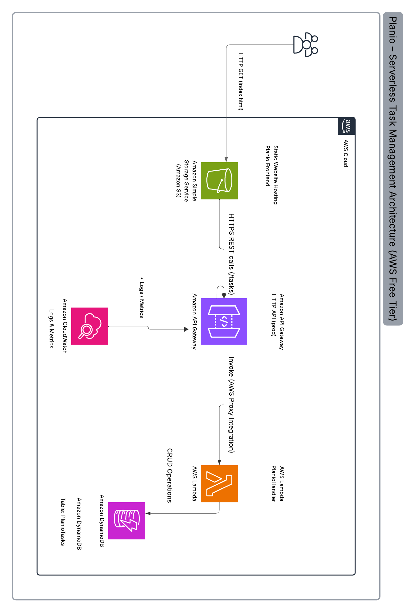

# Planio — Serverless Task Management Platform on AWS

Planio is a fully serverless task management application built on AWS.
The platform allows users to create, view, update, and delete tasks using
a RESTful API with a modern, scalable, and cost-efficient architecture.

## Architecture Overview

Planio is built using a serverless architecture that eliminates server
management while ensuring high scalability and availability.

User requests flow through Amazon API Gateway, which invokes AWS Lambda
functions responsible for handling business logic. Task data is stored in
Amazon DynamoDB, providing low-latency access and automatic scaling.
A static frontend is hosted on Amazon S3 and communicates with the backend
via REST APIs.
## AWS Services Used

- Amazon API Gateway (HTTP API)
- AWS Lambda (python)
- Amazon DynamoDB (On-Demand)
- Amazon S3 (Static Website Hosting)
- AWS IAM (Least-Privilege Access)
- Amazon CloudWatch (Logging & Monitoring)

planio-serverless-task-platform/
├─ infrastructure/
│  └─ template.yaml
├─ frontend/
│  └─ index.html
├─ architecture/
│  └─ planio-architecture.png
└─ README.md

# Planio — Serverless Task Management Platform on AWS

Planio is a fully serverless task management application built on AWS Free Tier-friendly services.
It provides a REST API for task CRUD operations and a lightweight static frontend.

## Deliverables
- Solution Architecture Diagram: `architecture/planio-architecture.png`
- Public GitHub Repository: this repo
- Optional (encouraged): Live URL (S3 static site) 

---

## Architecture Overview
Planio uses an event-driven serverless architecture:
- **Amazon S3** hosts the static frontend.
- **Amazon API Gateway (HTTP API)** exposes REST endpoints.
- **AWS Lambda** implements CRUD business logic.
- **Amazon DynamoDB** stores task records with automatic scaling.
- **Amazon CloudWatch** stores logs for monitoring and troubleshooting.

---

## AWS Services Used
- Amazon API Gateway (HTTP API)
- AWS Lambda (python)
- Amazon DynamoDB (On-Demand)
- Amazon S3 (Static Website Hosting)
- AWS IAM (Least Privilege)
- Amazon CloudWatch (Logs)

---

## API Specification
Base URL:
`https://{apiId}.execute-api.{region}.amazonaws.com/prod`

| Method | Endpoint | Description |
|---|---|---|
| POST | /tasks | Create a task |
| GET | /tasks | List tasks |
| GET | /tasks/{id} | Get one task |
| PUT | /tasks/{id} | Update a task |
| DELETE | /tasks/{id} | Delete a task |

## Live Demo (Optional Deliverable)

- Frontend (S3 Static Website):  
  http://planio-frontend-mary.s3-website.eu-north-1.amazonaws.com/

- Backend API (API Gateway HTTP API):  
  Base URL: https://k0yn5up6s8.execute-api.eu-north-1.amazonaws.com/prod  
  Tasks Endpoint: https://k0yn5up6s8.execute-api.eu-north-1.amazonaws.com/prod/tasks

### How to Use
1. Open the frontend URL.
2. Paste the API Base URL into the “API Base URL” input field:
   `https://k0yn5up6s8.execute-api.eu-north-1.amazonaws.com/prod`
3. Create tasks and refresh to view updates.

 

## Architecture Diagram

